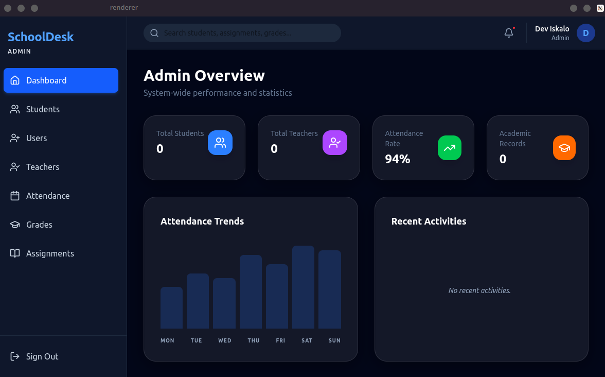

# 🎓 SchoolDesk

SchoolDesk is a **modern, offline-first School Management System** designed for high performance and zero-latency data access. It bridges the gap between desktop power and cloud connectivity using a robust edge-sync architecture.


_Local-First. Cloud-Synched. User-Centric._

---

## 🚀 Key Value Propositions

- **Zero Latency**: Every click is immediate. By using **RxDB**, data is read directly from memory (IndexedDB), providing a "game-like" response time.
- **Reliable Offline Mode**: Work in remote areas with poor internet. The system treats connectivity as an enhancement, not a requirement.
- **Secure Sync**: All local changes are queued and pushed to **Appwrite** in the background, ensuring data integrity across all your devices.
- **Role-Based Workflows**: Tailored experiences for Admins, Teachers, and Students.

## ✨ Core Features

### 📊 Admin Control Center

- **Dynamic Stats**: Real-time tracking of total students, teachers, and academic records.
- **Activity Feed**: Live event stream (new enrollments, assignment creation) aggregated from multiple collections.
- **User Management**: Granular control over system access and roles.

### 🍎 Academic Management

- **Student Profiles**: Comprehensive record-keeping for every student.
- **Teacher Portals**: Manage subjects, curriculum, and class assignments.
- **Gradebook**: Automated GPA calculations and performance tracking.
- **Attendance**: Quick-mark attendance sheets for teachers.

---

## 🏗️ Technical Architecture

SchoolDesk uses a **Hybrid Local-to-Cloud Sync** pattern:

1.  **Local Layer (RxDB)**: The "source of truth" while the app is running. Supports NoSQL queries, encryption, and real-time observability.
2.  **IPC Bridge**: Facilitates secure communication between the Electron background process and the React renderer.
3.  **Sync Engine**: A custom integration that monitors local changes via RxDB's change-stream and pushes them to Appwrite Collections using the `appwrite` JS SDK.
4.  **Cloud Layer (Appwrite)**: Provides authentication, global data persistence, and administrative APIs.

---

## 📁 Directory Structure

```text
├── appwrite/            # Appwrite client & initialization
├── database/            # RxDB setup, schemas, and migrations
├── electron/            # Main & Preload scripts (IPC management)
├── renderer/            # React + TypeScript Frontend
│   ├── src/
│   │   ├── components/  # Reusable UI components
│   │   ├── hooks/       # Logic hooks (useStudents, useRecentActivities, etc.)
│   │   ├── pages/       # Route-level screens
│   │   ├── store/       # Zustand auth & UI state
│   │   └── theme/       # Tailwind configuration & styles
├── sync/                # The custom Sync Engine logic
├── scripts/             # Infrastructure automation (setup-appwrite.mjs)
└── shared/              # Constant types and constants shared across layers
```

---

## 🛠️ Installation & Setup

### 1. Requirements

- Node.js v18.0.0+
- npm v9+

### 2. Environment Configuration

Create a `.env` file in the root directory:

```bash
VITE_APPWRITE_ENDPOINT=https://cloud.appwrite.io/v1
VITE_APPWRITE_PROJECT_ID=...
VITE_APPWRITE_DATABASE_ID=schooldesk
VITE_APPWRITE_API_KEY=... # Necessary for the setup script
```

### 3. Quick Start

```bash
# Clone the repository
git clone https://github.com/Deviskalo/school-desk.git

# Install all dependencies (Frontend + Electron)
npm install

# Provision the Appwrite backend automatically
npm run setup:appwrite

# Launch the desktop application
npm run dev
```

---

## 📋 Road Ahead

- [ ] **Phase 3**: Automated PDF Report Card generation.
- [ ] **Phase 3**: Financial/Fee tracking module.
- [ ] **Phase 4**: Native Mobile Companion app.

See [ROADMAP.md](ROADMAP.md) for the full development schedule.

---

## 🤝 Contributing & Support

We love community contributions! Please read our [CONTRIBUTING.md](CONTRIBUTING.md) to learn how to get involved.

Licensed under the **MIT License**. Created with ❤️ by [Dev Iskalo](https://github.com/Deviskalo).
